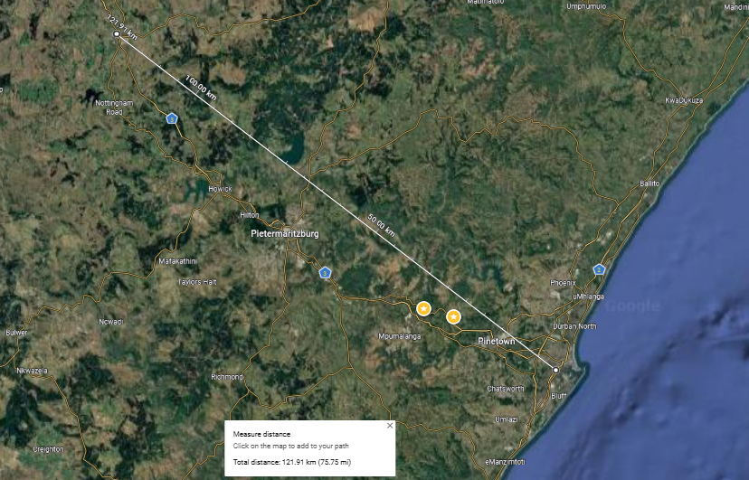

# Zero-Cost Hops in Meshtastic

Can a message traverse the mesh across huge distances while burning minimal hop count?

What if you want to send a message or position update from Durban to Mooi River (121 km) at a net cost of only **1 hop**?

  

As of firmware **v2.7.11**, this is possible using **Zero-Cost Hops**.

---

## What Roles Support Zero-Cost Hops?

Zero-Cost retransmissions apply strictly to nodes configured with the following roles:
* `ROUTER`
* `ROUTER_LATE`
* `CLIENT_BASE`

### The 3 Rules for Zero-Cost Retransmission
A node will relay a packet without decrementing its `hop_limit` **only if**:
1. The relaying node's role is `ROUTER`, `ROUTER_LATE`, or `CLIENT_BASE`.
2. The packet is **not on its very first hop** (the sender was not an edge client).
3. The previous relaying node is set as a **Favorite** in the receiving node's `NodeDB` and holds a `ROUTER` or `ROUTER_LATE` role.

---

## Examples

### 1. Metro Example

We have a `ROUTER` located at **T.B. Davis Flats** on a high-rise building in town, and a `CLIENT_BASE` at **Northpoint Flats** on a distant building.

* **T.B. Davis** and **Northpoint** have favorited each other in their node lists.
* **Peter** (`CLIENT`) wants to message **Lynn** (`CLIENT`). Both devices are set to a default `hop_limit` of **3**.

| Hop | Segment | Cost | Deduction | Remaining `hop_limit` |
| :--- | :--- | :--- | :---: | :---: |
| **1** | Peter $\to$ T.B. Davis | Normal (First Hop) | -1 | 2 |
| **2** | T.B. Davis $\to$ Northpoint | **Zero-Cost** (Favorited Router) | 0 | 2 |
| **3** | Northpoint $\to$ Lynn | Normal | -1 | 1 |

**Result:** Lynn receives the packet with **1 hop remaining**, despite the packet traversing two infrastructure relays.

---

### 2. Cross-Country Example (121 km)

We have a `ROUTER` at **T.B. Davis Flats** and three hilltop repeater `ROUTER` sites at **Alverstone**, **MC02**, and **EN60**.

* **Peter** (`CLIENT` in Durban) wants to message **Lynn** (`CLIENT`), who has gone on vacation to Mooi River. Both use a default `hop_limit` of **3**.

**Favorites Setup (Line of Sight / LOS):**
* **T.B. Davis** favorites **Alverstone** (LOS).
* **Alverstone** favorites **T.B. Davis**, **MC02**, and **EN60** (LOS to all three sites).
* **MC02** favorites **Alverstone** and **EN60** (LOS to both sites).
* **EN60** favorites **MC02** and **Alverstone** (LOS to both sites).

| Hop | Segment | Cost | Deduction | Remaining `hop_limit` |
| :--- | :--- | :--- | :---: | :---: |
| **1** | Peter $\to$ T.B. Davis | Normal (First Hop) | -1 | 2 |
| **2** | T.B. Davis $\to$ Alverstone | **Zero-Cost** | 0 | 2 |
| **3** | Alverstone $\to$ MC02 | **Zero-Cost** | 0 | 2 |
| **4** | MC02 $\to$ EN60 | **Zero-Cost** | 0 | 2 |
| **5** | EN60 $\to$ Lynn | Normal | -1 | 1 |

**Result:** The packet travels 121 km across 4 backbone relays, yet Lynn receives the message with **1 hop remaining** out of her original 3.
